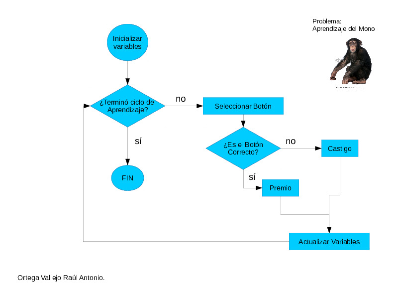

# Simulación de Aprendizaje
Concepto: Premio <-> Castigo 
Simulación del aprendizaje de un Mono, el cual si aprieta el botón de "comida", es recompenzado. 
De lo contrario se castiga la acción. 
  

 

